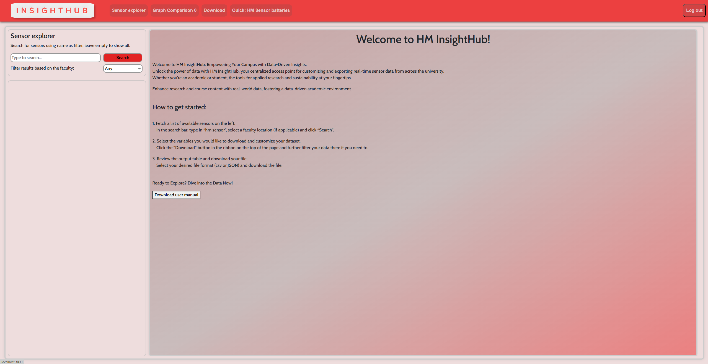
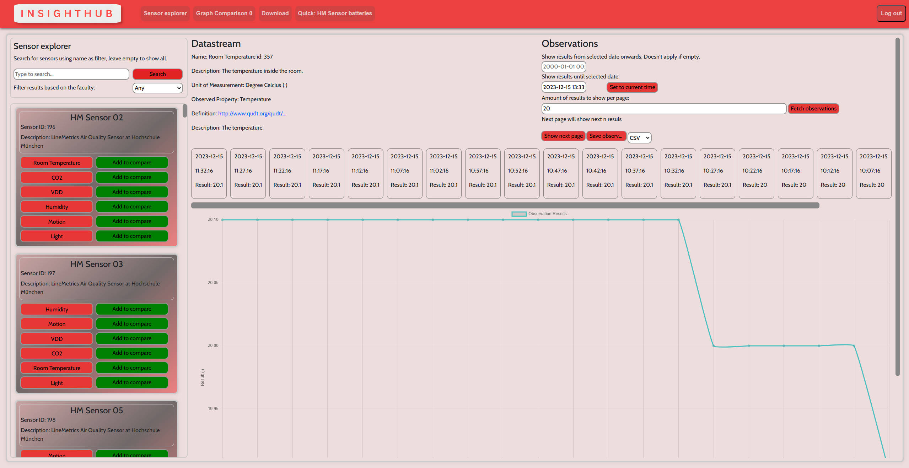
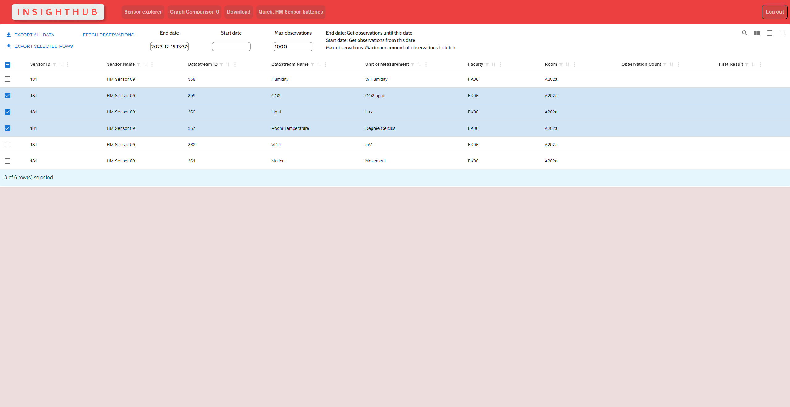
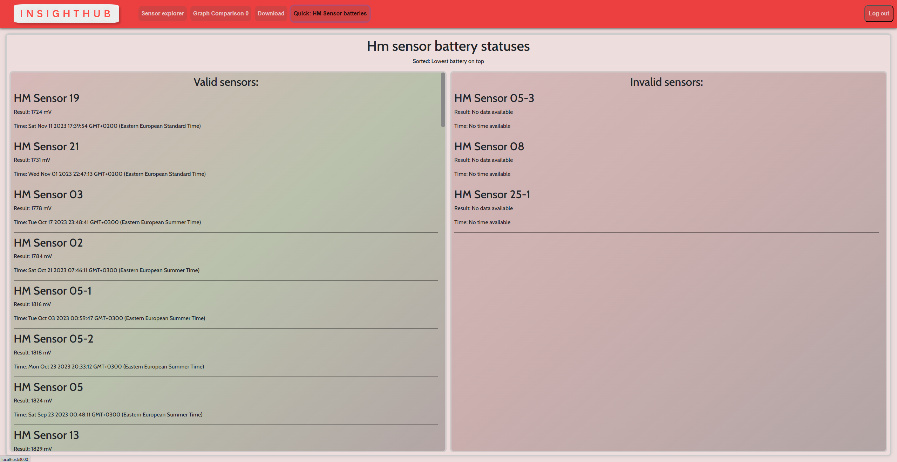
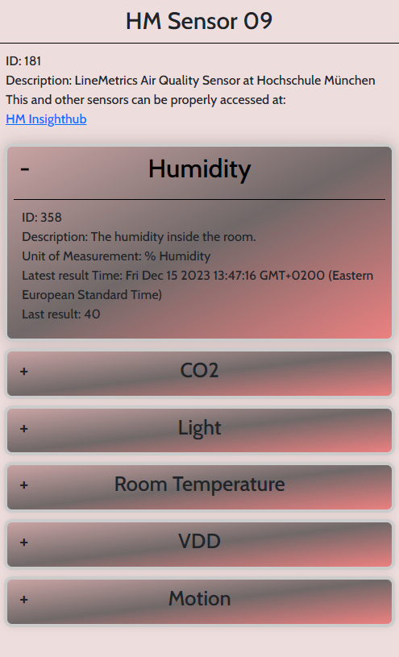

# Hm Sensors InsightHub

Welcome to Hm Sensors InsightHub, a powerful web application designed for sensor data exploration and analysis. This project showcases a comprehensive set of features to make working with sensor data from FROST servers seamless and insightful.

## Key Features

1. **Sensor Explorer:**
   - *Fetch, Explore, and Search:* Quickly fetch, explore, and search for a diverse range of sensors available on FROST servers and easily navigate through the sensor data to find the information you need.

2. **Graph Comparison:**
   - *Visualize Data Trends:* Utilize the graph comparison feature to compare observations from different sensors. Gain insights into data trends, variations, and correlations through graph visualization.

3. **Precise Filtering and Download:**
   - *Fine-tuned Data Selection:* Precise filtering options for dataset selection, ensuring you only work with the data that you specifically want. Download your filtered datasets for further analysis or documentation.

4. **Battery Status List:**
   - *Monitor Sensor Health:* Stay informed about the health of currently searched sensors with the Battery Status List. Understand battery levels and check for any potential issues to ensure continuous and reliable data collection.

5. **Mobile View with QR Code:**
   - *On-the-Go Access:* Experience the convenience of accessing sensor data on mobile devices with a dedicated mobile view. Simply scan the QR code associated with a specific sensor to view real-time information seamlessly.


## Screenshots

<div style="display: flex; flex-wrap: wrap; justify-content: center;">
  
  
  
  
  
</div>

## Technologies and Libraries Used

- [Docker](https://www.docker.com/) - Platform for developing, shipping, and running applications in containers.
- [AWS DynamoDB](https://aws.amazon.com/dynamodb/) - Fully managed NoSQL database service.
- [AWS Lambda](https://aws.amazon.com/lambda/) - Serverless computing service for running code without provisioning or managing servers.
- [AWS API Gateway](https://aws.amazon.com/api-gateway/) - Fully managed API service for building, deploying, and scaling APIs.
- [Node.js](https://nodejs.org/) - JavaScript runtime for server-side development.
- [React](https://reactjs.org/) - JavaScript library for building user interfaces.
- [TypeScript](https://www.typescriptlang.org/) - Typed superset of JavaScript that compiles to plain JavaScript.
- [react-material-table](https://github.com/dataform-co/react-material-table) - Material-UI based data table component for React.
- [Chart.js](https://www.chartjs.org/) - Simple yet flexible JavaScript charting library.
- [react-chartjs-2](https://github.com/reactchartjs/react-chartjs-2) - React wrapper for Chart.js, enabling easy integration with React applications.
- [react-export-excel](https://github.com/saame/react-export-excel) - Library for exporting data to Excel in React applications.

## Installation

### System Requirements

Ensure the following dependencies are installed on your machine before proceeding:

- [Docker](https://www.docker.com/get-started)
- [Node.js](https://nodejs.org/en/download/)
- Access to the GitLab repository: [Project Repo](https://gitlab.lrz.de/studi_projects/2023WS24_D3I/pc5_sensors_hm-sense/scrum-management)

### Install and Start the System

```bash
# Clone the App Repository
git clone https://gitlab.lrz.de/studi_projects/2023WS24_D3I/pc5_sensors_hm-sense/scrum-management.git

# Navigate to the Project Directory
cd scrum-management

# Build Docker Image
docker build -t hm_insighthub .

# Run the Docker Container
docker run -p 3000:80 -d hm_insighthub

# Check Container Status
docker ps

Access the application by opening your web browser and navigating to http://localhost:3000.
```

## Usage

- Start the system and explore the available sensors.
- Utilize the "Sensor Explorer" to fetch and search for sensors from FROST servers.
- Compare observations from different sensors using the "Graph Comparison" feature.
- Employ precise filtering to narrow down datasets, and download the selected data for analysis.
- Monitor the battery status of currently searched sensors with the "Battery Status List."
- Access a mobile view for a specific sensor by scanning its QR code.

Follow these steps to make the most of the system:

1. **Sensor Explorer:**
   - Launch the application and navigate to the "Sensor Explorer" section.
   - Use the search functionality to fetch and explore sensors from FROST servers.

2. **Graph Comparison:**
   - Compare observations from different sensors using the "Graph Comparison" feature.
   - Gain insights into data trends and variations through interactive visualizations.

3. **Precise Filtering and Download:**
   - Navigate to the "Dataset" section and utilize precise filtering options for dataset selection.
   - Download the filtered datasets for further analysis or documentation.

4. **Battery Status List:**
   - Check the health of currently searched sensors in the "Battery Status List" section.
   - Receive alerts for potential issues to ensure continuous and reliable data collection.

5. **Mobile View with QR Code:**
   - Access a dedicated mobile view for a specific sensor by scanning its QR code.

## Conclusion

Thank you for exploring Hm Sensors InsightHub! We hope this tool proves valuable for your sensor data exploration and analysis needs.

